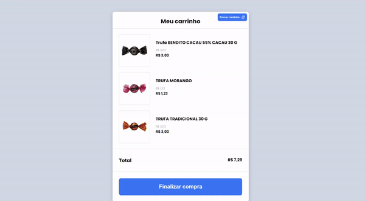

### `npm run server`

- Inicia o json-server (fake api) para consumir os dados da API na porta 3333 

*** http://localhost:3333/below-ten ***  

*** http://localhost:3333/above-ten ***

### `npm start`

- Para iniciar o projeto na porta 3000 *** http://localhost:3000 ***

### `npm run build`

- Para realizar o build do projeto

### `links api heroku`

**https://products-api-minicart.herokuapp.com/below-ten**
**https://products-api-minicart.herokuapp.com/above-ten**
### `Trocar carrinho`

- O botão trocar carrinho é utilizado para alternar os produtos para que mostre a mensagem de frete grátis.

 

